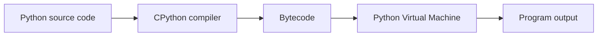
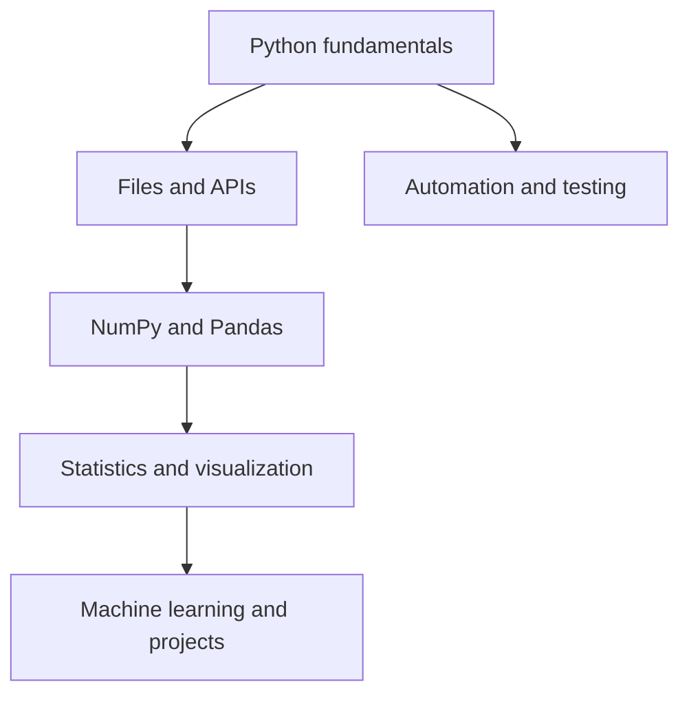

# Chapter 1 - Introduction to Python

**Volume:** 1 - Python Fundamentals<br>
**Version:** v0.3<br>
**Stage:** QA<br>
**Quality:** 3 stars - Tested<br>
**Estimated Reading Time:** 60-90 minutes<br>
**Prerequisites:** None<br>
**Review Date:** 2026-07-23

## Version History

| Version | Change | Date |
| --- | --- | --- |
| v0.1 | Initial complete draft | 2026-07-23 |
| v0.2 | Technical review corrections applied | 2026-07-23 |
| v0.3 | All manuscript Python examples executed | 2026-07-23 |

## 1. Learning Objectives

After completing this chapter, you will be able to:

- Define Python and distinguish a programming language from its implementation.
- Describe why Python was created and summarize important milestones in its history.
- Explain Python's readability, dynamic typing, indentation, and library ecosystem.
- Identify common uses and realistic limits of Python.
- Write and explain a first Python program.
- Describe the basic CPython execution path from source code to bytecode and execution.
- Recognize common beginner mistakes and choose sensible next steps for learning.

## Coverage Checklist

- [x] Theory
- [x] Internal Working
- [x] Diagrams
- [x] Runnable Examples
- [x] Practice
- [x] Assignments
- [x] Interview Questions
- [x] Cheat Sheet
- [x] References
- [x] Technical Review
- [ ] Final QA

## 2. Prerequisites

No programming experience is required. You only need a computer on which Python can be installed in Chapter 2.

## 3. Introduction

Python is a high-level, general-purpose programming language designed to make programs readable and development productive. Python code is written as text, interpreted by a Python implementation, and supported by a large standard library and third-party ecosystem.

> **Established Fact:** Python is a language; CPython is the reference implementation most commonly installed from python.org. Other implementations can execute Python code as well.

Python is not limited to one profession. The same language can support a small automation script, a data-analysis notebook, a web API, or a machine-learning workflow. This range is useful, but it does not mean Python is automatically the best choice for every technical problem.

## 4. History (if applicable)

Guido van Rossum began developing Python in December 1989 while working at Centrum Wiskunde & Informatica in the Netherlands. Python 0.9.0 was released in February 1991. Python 2.0 followed in October 2000, and Python 3.0 was released in December 2008.

Python 3 intentionally corrected and simplified several parts of the language. Python 2 reached its official end of life on January 1, 2020. New projects should use a supported Python 3 release.

| Year | Milestone |
| --- | --- |
| 1989 | Guido van Rossum begins developing Python. |
| 1991 | Python 0.9.0 is released publicly. |
| 2000 | Python 2.0 is released. |
| 2008 | Python 3.0 is released. |
| 2020 | Python 2 reaches end of life. |

See the [official Python history](https://www.python.org/doc/essays/foreword/) and [Python 2.7 status](https://www.python.org/doc/sunset-python-2/) for historical context.

## 5. Why This Topic Matters

Learning Python is valuable because it lowers the amount of syntax needed to express an idea while still giving learners access to professional tools. Readable code is easier to debug, review, maintain, and explain to a teammate.

Python is especially relevant to data analytics because analysts can combine file handling, data transformation, statistics, visualization, and automation in one ecosystem. The language also provides a gentle path from short scripts to larger software projects.

> **Best Practice:** Treat readability as a technical requirement. A short program that nobody can understand is not automatically better than a longer, clearer one.

## 6. Core Theory

### High-level language

A high-level language provides abstractions that are closer to human problem-solving than to processor instructions. Instead of manually managing CPU registers, a Python programmer can write:

**Code metadata:** Python Version: 3.12+; Status: Tested; Expected Output: Yes; Dependencies: None

```python
print("Hello, Python!")
```

Python and its implementation handle the lower-level work required to execute this statement.

### General-purpose language

Python can be used for web services, data analysis, scientific computing, automation, testing, education, and machine learning. General-purpose does not mean equally optimal for all tasks; systems with strict real-time or low-level hardware constraints may require another language.

### Dynamic typing

Python associates types with values rather than requiring a type declaration for every variable:

**Code metadata:** Python Version: 3.12+; Status: Tested; Expected Output: Yes; Dependencies: None

```python
value = 10
print(type(value).__name__)

value = "ten"
print(type(value).__name__)
```

Expected output:

```text
int
str
```

The variable name `value` is rebound to a string; the values themselves still have types. Dynamic typing makes experimentation convenient, but clear naming and testing remain important.

### Indentation

Indentation is part of Python's syntax. It groups statements into blocks:

**Code metadata:** Python Version: 3.12+; Status: Tested; Expected Output: Yes; Dependencies: None

```python
temperature = 24

if temperature > 20:
	print("A warm day")
```

The indented `print` statement belongs to the `if` block. Inconsistent indentation can cause an `IndentationError` or change the program's logic.

## 7. Internal Working

The exact execution model depends on the implementation. In CPython, source code is compiled into bytecode, and the Python Virtual Machine executes that bytecode. This is why calling Python simply “step-by-step interpretation” is a useful beginner shorthand but an incomplete technical description.



> **Implementation Detail:** CPython may cache compiled bytecode in `__pycache__`, but this is an implementation detail and not a promise that applies identically to every Python implementation.

Other implementations include PyPy, which uses a just-in-time compilation strategy for some workloads, and MicroPython, which targets constrained devices. The language concepts in this book primarily assume a current Python 3 implementation and identify implementation-specific behavior when it matters.

## 8. Visual Diagram

The following concept map shows how Python fits into a data-analytics workflow:



## 9. Syntax

Python statements commonly use names, values, operators, function calls, and indentation. A first complete statement is a function call:

**Code metadata:** Python Version: 3.12+; Status: Tested; Expected Output: Yes; Dependencies: None

```python
print("Welcome to Python")
```

The name `print` identifies a built-in function. Parentheses contain the argument passed to that function, and the quoted text is a string value.

## 10. Examples (Easy to Advanced)

### [Beginner] Hello, Python

**Code metadata:** Python Version: 3.12+; Status: Tested; Expected Output: Yes; Dependencies: None

```python
name = "Harish"
print(f"Welcome, {name}!")
```

Expected output:

```text
Welcome, Harish!
```

### [Intermediate] A small decision

**Code metadata:** Python Version: 3.12+; Status: Tested; Expected Output: Yes; Dependencies: None

```python
score = 82

if score >= 50:
	result = "pass"
else:
	result = "review"

print(result)
```

Expected output:

```text
pass
```

### [Advanced] A reusable summary function

**Code metadata:** Python Version: 3.12+; Status: Tested; Expected Output: Yes; Dependencies: None

```python
def summarize_scores(scores):
	average = sum(scores) / len(scores)
	passed = sum(score >= 50 for score in scores)
	return average, passed


average, passed = summarize_scores([72, 48, 91, 65])
print(f"Average: {average:.1f}")
print(f"Passed: {passed}")
```

Expected output:

```text
Average: 69.0
Passed: 3
```

This example combines a function, a list, a generator expression, built-in functions, and formatted output. These concepts are introduced separately in later chapters.

## 11. Real-world Applications

Python is publicly documented as being used in areas including:

- Data analysis and scientific computing with tools such as NumPy and pandas.
- Web applications and APIs with frameworks such as Django, Flask, and FastAPI.
- Automation, testing, and command-line tools.
- Machine learning and artificial intelligence.
- Education, research, and scripting for cloud platforms.

The Python Software Foundation maintains [Python Success Stories](https://www.python.org/success-stories/) documenting examples of Python in practice.

The practical lesson is to choose libraries and architecture based on the problem, performance requirements, security needs, and team expertise. Python can be the main application language or a supporting language around optimized native libraries.

## 12. Best Practices

- Use a supported Python 3 release for new projects.
- Prefer clear names and small, understandable steps.
- Use four spaces for indentation and avoid mixing tabs and spaces.
- Test examples in the stated Python version.
- Keep third-party dependencies documented.
- Read official documentation when behavior matters.
- Separate exploratory code from reusable code as projects grow.

## 13. Common Mistakes

- Confusing Python the language with CPython the implementation.
- Assuming “interpreted” means no compilation occurs.
- Mixing Python 2 tutorials with Python 3 code.
- Using inconsistent indentation.
- Copying code without understanding its inputs and outputs.
- Treating a library's behavior as a language rule without checking its documentation.
- Believing that readable syntax eliminates the need for testing.

## 14. Debugging Tips

When a first program fails, use a small, repeatable process:

1. Read the final line of the traceback first; it often names the immediate error.
2. Check spelling, quotes, parentheses, and indentation.
3. Confirm the Python version running the file.
4. Reduce the program to the smallest failing example.
5. Print intermediate values when the program runs but produces an unexpected result.
6. Change one thing at a time and rerun the example.

## 15. Performance Notes

Python prioritizes developer productivity and a broad ecosystem. A simple Python program may be slower than equivalent native machine code, but performance depends on the task, implementation, algorithm, and libraries involved.

Do not optimize an introductory example by instinct. First establish correct behavior, then measure a representative workload. Data-analysis libraries often move expensive operations into optimized compiled code, so the performance of a Python program cannot be inferred from the speed of a short loop alone.

## 16. Interview Questions

1. What makes Python a high-level, general-purpose language?
2. What is the difference between Python the language and CPython the implementation?
3. Is Python compiled or interpreted? Explain the answer precisely.
4. What does dynamic typing mean in Python?
5. Why is indentation significant in Python?
6. When might Python not be the best choice for a task?

## 17. MCQs

1. **Which statement best describes CPython?**
   - A. A Python package manager
   - B. A commonly used implementation of Python
   - C. A database system
   - D. A code formatter

   **Answer:** B

2. **What does Python use to group statements into blocks?**
   - A. Curly braces only
   - B. Semicolons only
   - C. Indentation
   - D. SQL keywords

   **Answer:** C

3. **Which is an implementation detail of CPython?**
   - A. Python supports strings
   - B. Python has functions
   - C. CPython executes bytecode using a virtual machine
   - D. Python can be used for automation

   **Answer:** C

## 18. Coding Exercises

1. Print your name, target role, and one reason you are learning Python.
2. Store a temperature in a variable and print whether it is below, equal to, or above 20 degrees.
3. Write a function that receives a list of numbers and returns its smallest value, largest value, and average.
4. Add input validation to the previous function so an empty list produces a clear error message.

## 19. Assignments

Write a one-page “Python in my field” report. Choose one real application, explain the problem Python helps solve, name two relevant libraries or tools, and include at least two reputable references. Mark each claim as an established fact, implementation detail, best practice, or clearly labeled opinion where appropriate.

## 20. Mini Project

### Personal Learning Profile

Create a command-line program that stores a learner's name, target role, weekly study hours, and current Python confidence level. The program should print a formatted profile and recommend one next learning action based on the confidence level.

Requirements:

- Use variables, strings, numbers, and an `if` statement.
- Put the recommendation logic in a function.
- Include at least three test cases in comments or a separate test file.
- Document the Python version and expected output.

## 21. Case Study

### Automating a Weekly Analytics Report

A small operations team receives a spreadsheet every Friday. A person manually checks missing values, calculates totals, and emails a summary. A Python solution could read the file, validate its columns, calculate the summary, and produce a report.

The first design decision is not “Which library should we import?” It is to define the input contract, expected output, error conditions, and review process. Python may be a good fit because the task combines file handling, data processing, and automation. The team should still measure reliability, protect sensitive data, and keep a human review step until the automated result is trusted.

## 22. Summary

Python is a readable, high-level, general-purpose language used across software development, analytics, science, and automation. It is dynamically typed and uses indentation to define blocks. In CPython, source code is compiled to bytecode and executed by the Python Virtual Machine, although the exact implementation model can vary.

Good Python work combines readable code with testing, documentation, appropriate references, and sensible tool selection. The next chapter will make the local installation and execution environment predictable.

## 23. Cheat Sheet

| Concept | Key point |
| --- | --- |
| Python | A high-level, general-purpose programming language |
| CPython | A commonly used Python implementation |
| Dynamic typing | Values have types; names can be rebound to values of different types |
| Indentation | Defines statement blocks in Python |
| Bytecode | An intermediate executable representation in CPython |
| PVM | Executes Python bytecode in CPython |
| `print()` | Displays a value or message |
| `if` | Runs a block conditionally |
| Function | A reusable unit of behavior defined with `def` |

## 24. Glossary

| Term | Definition |
| --- | --- |
| Bytecode | An intermediate form of instructions produced by some Python implementations. |
| CPython | The most widely used implementation of the Python language. |
| Dynamic typing | A typing model in which values have types and names do not require fixed declarations. |
| General-purpose | Suitable for many categories of programming rather than one narrow domain. |
| Interpreter | A program that executes code for a programming language. |
| Library | Reusable code that provides functionality to other programs. |
| Python Virtual Machine | The execution component that runs CPython bytecode. |
| Syntax | The rules that determine how valid code is written. |

## 25. References

1. [Python Documentation - About Python](https://www.python.org/about/)
2. [Python Documentation - History and License](https://www.python.org/doc/essays/foreword/)
3. [The Python Language Reference](https://docs.python.org/3/reference/)
4. [Python Tutorial - An Informal Introduction to Python](https://docs.python.org/3/tutorial/introduction.html)
5. [Python Glossary - CPython](https://docs.python.org/3/glossary.html#term-CPython)
6. [Python 2.7 Countdown and Sunset](https://www.python.org/doc/sunset-python-2/)
7. [Python Packaging User Guide](https://packaging.python.org/en/latest/)
8. [Python Success Stories](https://www.python.org/success-stories/)
9. [Python Language Reference - Alternate Implementations](https://docs.python.org/3/reference/introduction.html#alternate-implementations)

## See Also

- [Chapter 2 - Installation](../02-Installation/README.md) - Install Python and configure the development environment.
- [Chapter 3 - Variables](../03-Variables/README.md) - Explore names, values, and assignment in more detail.
- [Chapter 4 - Data Types](../04-Data-Types/README.md) - Study the types introduced in this chapter.
- [Chapter 14 - Functions](../14-Functions/README.md) - Build reusable behavior beyond the examples here.

## Looking Ahead

**Next Chapter:** Chapter 2 - Installation and Environment Setup<br>
**You'll learn:**

- How to install a supported Python 3 release.
- How to verify Python with `python --version`.
- How to install and configure VS Code.
- How to create a virtual environment.
- How to run Python from the terminal and VS Code.
